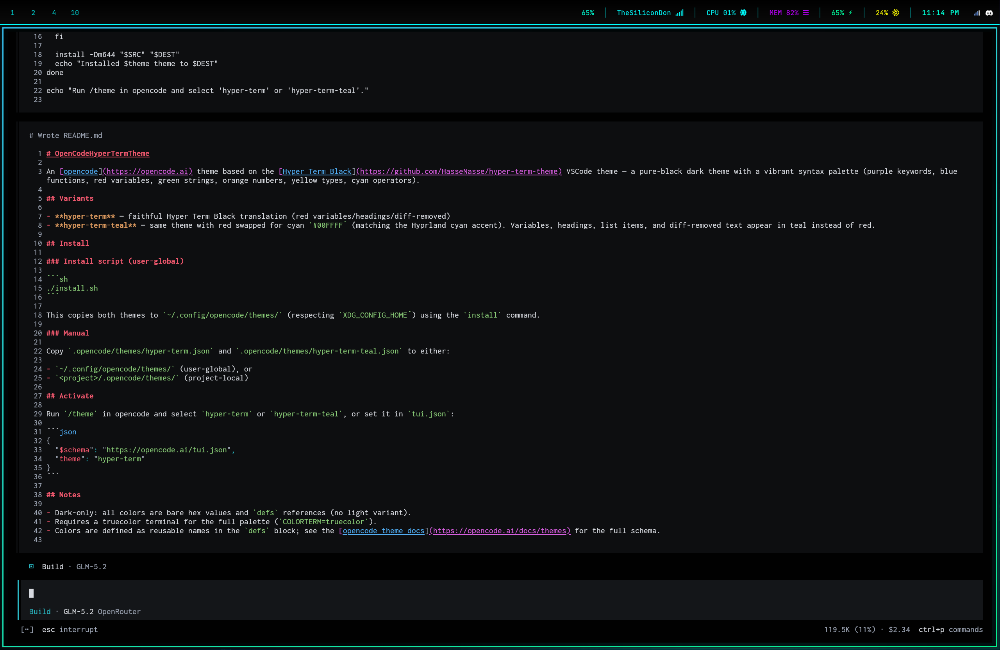

# OpenCodeHyperTermTheme

An [opencode](https://opencode.ai) theme based on the [Hyper Term Black](https://github.com/HasseNasse/hyper-term-theme) VSCode theme — a pure-black dark theme with a vibrant syntax palette (purple keywords, blue functions, red variables, green strings, orange numbers, yellow types, cyan operators).

## Screenshots

### hyper-term-red



### hyper-term-teal


## Variants

Each variant swaps the variable/heading/list/diff-removed accent to match a
Hyprland UI theme (the same hex values used by the `toggle-theme.sh` palette):

| variant | accent | hex |
|---|---|---|
| **hyper-term-red** | red | `#ef596f` |
| **hyper-term-teal** | teal | `#00ffff` |
| **hyper-term-green** | green | `#33ff55` |
| **hyper-term-yellow** | yellow | `#ffdd00` |
| **hyper-term-orange** | orange | `#ff8833` |
| **hyper-term-purple** | purple | `#bd00ff` |
| **hyper-term-white** | white | `#D7DAE0` |

All variants share the same Hyper Term Black base (pure-black background, purple
keywords, blue functions, green strings, orange numbers, yellow types, cyan
operators); only the variable/heading/list/diff-removed color changes.

## Install

### Install script (user-global)

```sh
./install.sh
```

This copies all `hyper-term-*` themes to `~/.config/opencode/themes/`
(respecting `XDG_CONFIG_HOME`) using the `install` command.

### Manual

Copy the `.opencode/themes/hyper-term-*.json` files to either:

- `~/.config/opencode/themes/` (user-global), or
- `<project>/.opencode/themes/` (project-local)

## Activate

Run `/theme` in opencode and select a `hyper-term-*` variant, or set it in
`tui.json`:

```json
{
  "$schema": "https://opencode.ai/tui.json",
  "theme": "hyper-term-purple"
}
```

## Notes

- Dark-only: all colors are bare hex values and `defs` references (no light variant).
- Requires a truecolor terminal for the full palette (`COLORTERM=truecolor`).
- Colors are defined as reusable names in the `defs` block; see the [opencode theme docs](https://opencode.ai/docs/themes) for the full schema.
