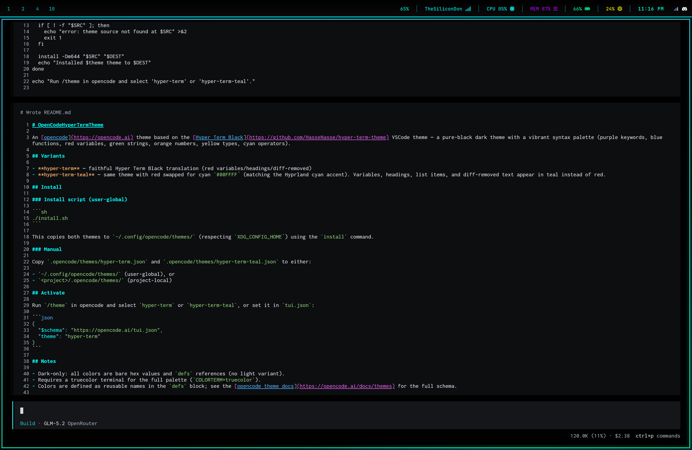

# OpenCodeHyperTermTheme

An [opencode](https://opencode.ai) theme based on the [Hyper Term Black](https://github.com/HasseNasse/hyper-term-theme) VSCode theme — a pure-black dark theme with a vibrant syntax palette (purple keywords, blue functions, red variables, green strings, orange numbers, yellow types, cyan operators).

## Screenshots

### hyper-term


### hyper-term-teal



## Variants

- **hyper-term** — faithful Hyper Term Black translation (red variables/headings/diff-removed)
- **hyper-term-teal** — same theme with red swapped for cyan `#00FFFF` (matching the Hyprland cyan accent). Variables, headings, list items, and diff-removed text appear in teal instead of red.

## Install

### Install script (user-global)

```sh
./install.sh
```

This copies both themes to `~/.config/opencode/themes/` (respecting `XDG_CONFIG_HOME`) using the `install` command.

### Manual

Copy `.opencode/themes/hyper-term.json` and `.opencode/themes/hyper-term-teal.json` to either:

- `~/.config/opencode/themes/` (user-global), or
- `<project>/.opencode/themes/` (project-local)

## Activate

Run `/theme` in opencode and select `hyper-term` or `hyper-term-teal`, or set it in `tui.json`:

```json
{
  "$schema": "https://opencode.ai/tui.json",
  "theme": "hyper-term"
}
```

## Notes

- Dark-only: all colors are bare hex values and `defs` references (no light variant).
- Requires a truecolor terminal for the full palette (`COLORTERM=truecolor`).
- Colors are defined as reusable names in the `defs` block; see the [opencode theme docs](https://opencode.ai/docs/themes) for the full schema.
